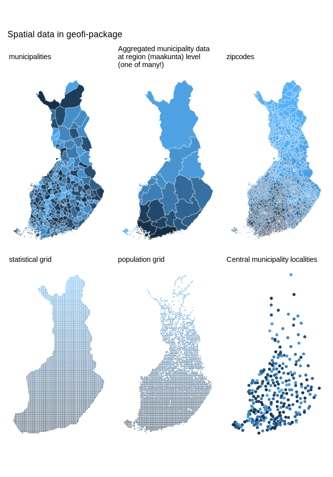

  <!-- badges: start --> 

<!-- badges: end -->

 

# geofi - Access Finnish Geospatial Data 

<!-- README.md is generated from README.Rmd. Please edit that file -->

Access Finnish Geospatial Data.

## Installation and use

    # install from CRAN
    install.packages("geofi")

    # Install development version from GitHub
    remotes::install_github("ropengov/geofi")

With `geofi`-package you can download geospatial data on municipalities,
zipcodes and population and statistical grids from Statistics Finland
[WFS-api](https://www.stat.fi/org/avoindata/paikkatietoaineistot_en.html).
In addition, you have on-board municipality keys for aggregating
municipality-level data into higher level regional distributions based
Statistics Finland [classification
API](https://data.stat.fi/api/classifications/v2/).

Below are few examples of the data you can access using `geofi`. Please
have a closer look at the
[vignettes](https://ropengov.github.io/geofi/articles/index.html) for
more comprehensive use cases.

    library(geofi)
    d1 <- get_municipalities(year = 2020)
    d2 <- get_zipcodes(year = 2020)
    d3 <- get_statistical_grid(resolution = 5)
    d4 <- get_population_grid(resolution = 5)

    library(ggplot2)
    library(dplyr)
    theme_set(
      theme_minimal(base_family = "Arial") +
      theme(legend.position= "none",
            axis.text = element_blank(),
            axis.title = element_blank(),
            panel.grid = element_blank()
            )
    )
    p1 <- ggplot(d1, aes(fill = kunta)) + geom_sf(colour = alpha("white", 1/3)) + labs(subtitle = "municipalities")
    p2 <- ggplot(d1 %>% count(maakunta_code), aes(fill = maakunta_code)) + geom_sf(colour = alpha("white", 1/3)) + labs(subtitle = "Aggregated municipality data \nat region (maakunta) level \n(one of many!)")
    p3 <- ggplot(d2, aes(fill = as.integer(posti_alue))) + geom_sf(colour = alpha("white", 1/3)) + labs(subtitle = "zipcodes")
    p4 <- ggplot(d3, aes(fill = nro)) + geom_sf(colour = alpha("white", 1/3)) + labs(subtitle = "statistical grid")
    p5 <- ggplot(d4, aes(fill = id_nro)) + geom_sf(colour = alpha("white", 1/3)) + labs(subtitle = "population grid")
    p6 <- ggplot(municipality_central_localities, aes(color = as.integer(kuntatunnus))) + geom_sf() + labs(subtitle = "Central municipality localities")

    library(patchwork)
    wrap_plots(list(p1,p2,p3,p4,p5,p6), ncol = 3) + 
      patchwork::plot_annotation(title = "Spatial data in geofi-package")

### Contribute

Contributions are very welcome:

-   [Use issue tracker](https://github.com/ropengov/geofi/issues) for
    feedback and bug reports.
-   [Send pull requests](https://github.com/ropengov/geofi/)
-   [Star us on the Github page](https://github.com/ropengov/geofi/)
-   [Join the discussion in Gitter](https://gitter.im/rOpenGov/geofi/)

### Acknowledgements

**Kindly cite this work** as follows: [Markus
Kainu](https://github.com/muuankarski), [Joona
Lehtomäki](https://github.com/jlehtoma), Juuso Parkkinen, Jani
Miettinen, Pyry Kantanen, [Leo Lahti](https://github.com/antagomir)
Retrieval and analysis of open geospatial data from Finland with the
geofi R package. R package version 1.0.00002. URL:
<https://ropengov.github.io/geofi/>

We are grateful to all
[contributors](https://github.com/rOpenGov/geofi/graphs/contributors).
This project is part of [rOpenGov](http://ropengov.org).

