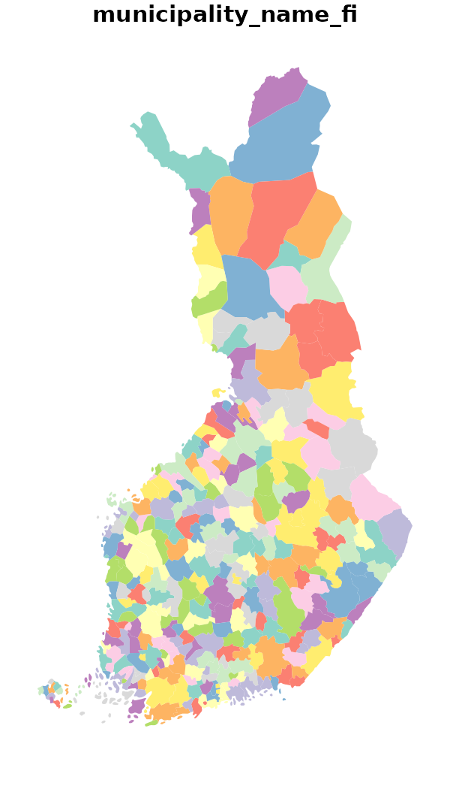
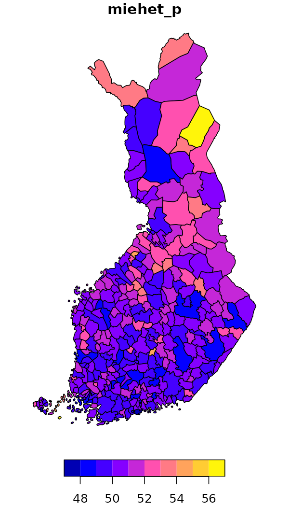
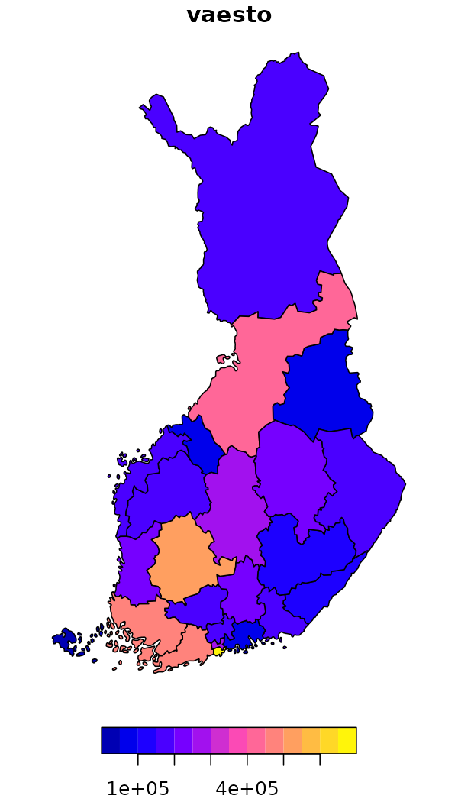
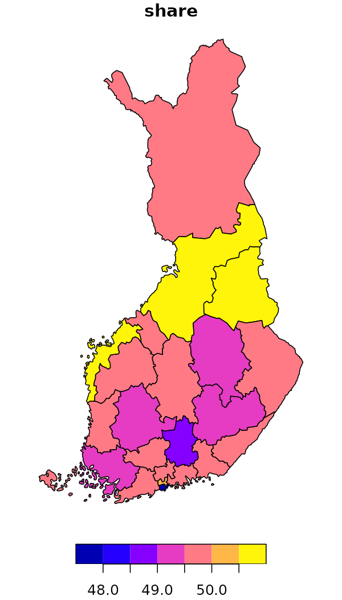
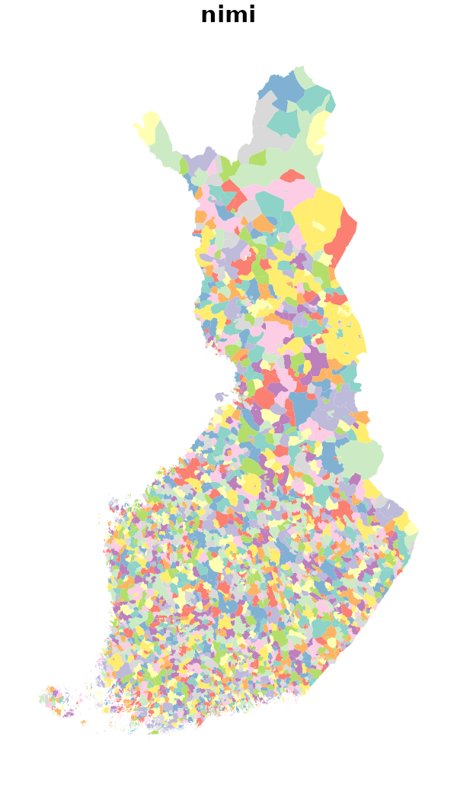
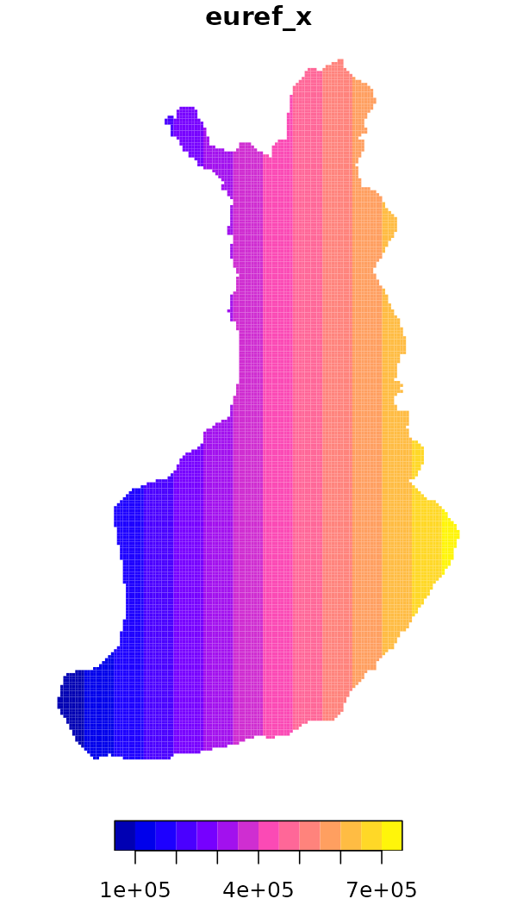
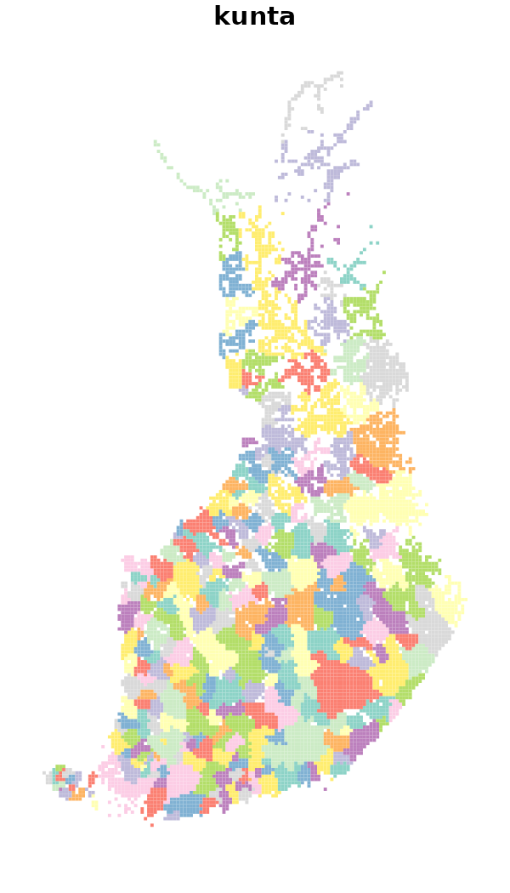
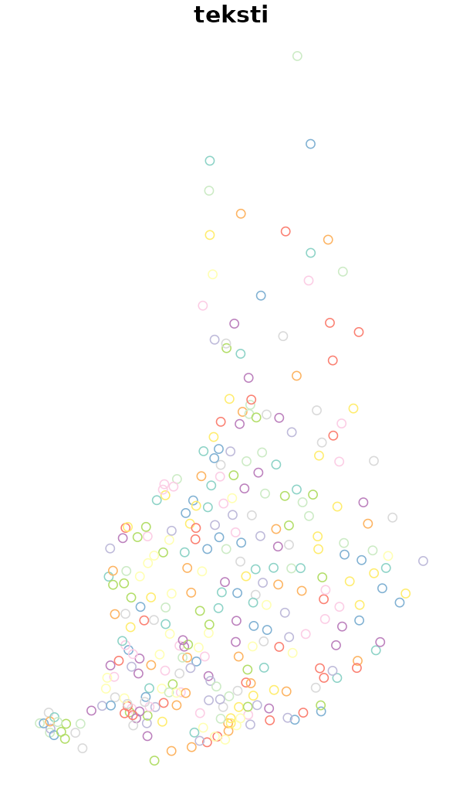
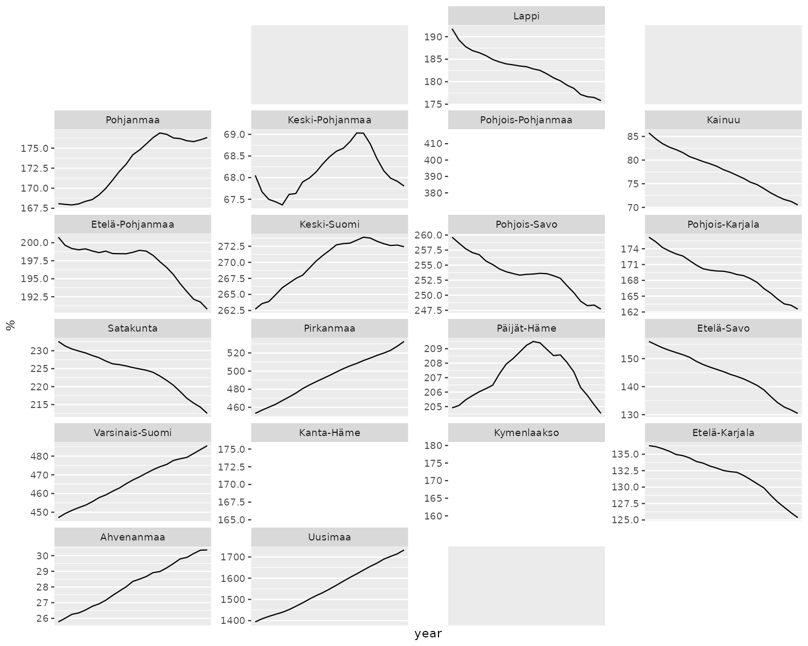

# Datasets in geofi-package

**`geofi`-package provides access to multiple dataset of different types
and for different use. In this vignette we introduce the different datas
and explain their use cases. Vignette *Making maps using
`geofi`-package* provides multiple real-world examples of their usage.**

**Packages installation**

`geofi` can be installed from CRAN using

``` r
# install from CRAN
install.packages("geofi")

# Install development version from GitHub
remotes::install_github("ropengov/geofi")
```

## Municipality keys

Official administrative regions in Finland are based on municipalities.
In 2021 there are 309 municipalities in Finland and the number is
decreasing over time through mergers.  
  
Each municipality belongs to a higher level regional classifications
such as regions (maakunta) or health care districts (sairaanhoitopiiri).
`municipality_key_`-datasets are based on Statistics Finland
[Statistical
classification](https://data.stat.fi/api/classifications/v2/classifications)
-api with few modification and provided on yearly basis.

``` r
library(geofi)
library(dplyr)
d <- data(package = "geofi")
as_tibble(d$results) |> 
  select(Item,Title) |> 
    filter(grepl("municipality_key", Item))
#> # A tibble: 15 × 2
#>    Item                  Title                                                
#>    <chr>                 <chr>                                                
#>  1 municipality_key      Aggregated municipality key table for years 2013-2026
#>  2 municipality_key_2013 municipality_key_2013                                
#>  3 municipality_key_2014 municipality_key_2014                                
#>  4 municipality_key_2015 municipality_key_2015                                
#>  5 municipality_key_2016 municipality_key_2016                                
#>  6 municipality_key_2017 municipality_key_2017                                
#>  7 municipality_key_2018 Municipality key table for 2018                      
#>  8 municipality_key_2019 Municipality key table for 2019                      
#>  9 municipality_key_2020 Municipality key table for 2020                      
#> 10 municipality_key_2021 Municipality key table for 2021                      
#> 11 municipality_key_2022 Municipality key table for 2022                      
#> 12 municipality_key_2023 Municipality key table for 2023                      
#> 13 municipality_key_2024 Municipality key table for 2024                      
#> 14 municipality_key_2025 Municipality key table for 2025                      
#> 15 municipality_key_2026 Municipality key table for 2026
```

Looking at the names of \`municipality_key_2023\` there is 69 different
variables from each municipality.

``` r
names(geofi::municipality_key_2023)
#>  [1] "kunta"                   "municipality_name_fi"   
#>  [3] "municipality_name_sv"    "municipality_name_en"   
#>  [5] "avi_code"                "avi_name_fi"            
#>  [7] "avi_name_sv"             "avi_name_en"            
#>  [9] "ely_code"                "ely_name_fi"            
#> [11] "ely_name_sv"             "ely_name_en"            
#> [13] "kielisuhde_code"         "kielisuhde_name_fi"     
#> [15] "kielisuhde_name_sv"      "kielisuhde_name_en"     
#> [17] "kuntaryhmitys_code"      "kuntaryhmitys_name_fi"  
#> [19] "kuntaryhmitys_name_sv"   "kuntaryhmitys_name_en"  
#> [21] "maakunta_code"           "maakunta_name_fi"       
#> [23] "maakunta_name_sv"        "maakunta_name_en"       
#> [25] "seutukunta_code"         "seutukunta_name_fi"     
#> [27] "seutukunta_name_sv"      "seutukunta_name_en"     
#> [29] "tyossakayntial_code"     "tyossakayntial_name_fi" 
#> [31] "tyossakayntial_name_sv"  "tyossakayntial_name_en" 
#> [33] "year"                    "suuralue_code"          
#> [35] "suuralue_name_fi"        "suuralue_name_sv"       
#> [37] "suuralue_name_en"        "nuts1_code"             
#> [39] "nuts1_name_fi"           "nuts1_name_sv"          
#> [41] "nuts1_name_en"           "nuts2_code"             
#> [43] "nuts2_name_fi"           "nuts2_name_sv"          
#> [45] "nuts2_name_en"           "nuts3_code"             
#> [47] "nuts3_name_fi"           "nuts3_name_sv"          
#> [49] "nuts3_name_en"           "vaalipiiri_code"        
#> [51] "vaalipiiri_name_fi"      "vaalipiiri_name_sv"     
#> [53] "vaalipiiri_name_en"      "hyvinvointialue_code"   
#> [55] "hyvinvointialue_name_fi" "hyvinvointialue_name_sv"
#> [57] "hyvinvointialue_name_en" "yhteistyoalue_code"     
#> [59] "yhteistyoalue_name_fi"   "yhteistyoalue_name_sv"  
#> [61] "yhteistyoalue_name_en"   "municipality_code"      
#> [63] "kunta_name"              "name_fi"                
#> [65] "name_sv"
```

With these municipality keys you can easily aggregate municipalities for
plotting or you can list different regional breakdowns.  

``` r
geofi::municipality_key_2023 |> 
  count(maakunta_code,maakunta_name_fi,maakunta_name_sv,maakunta_name_en)
#> # A tibble: 19 × 5
#>    maakunta_code maakunta_name_fi  maakunta_name_sv      maakunta_name_en      n
#>            <int> <chr>             <chr>                 <chr>             <int>
#>  1             1 Uusimaa           Nyland                Uusimaa              26
#>  2             2 Varsinais-Suomi   Egentliga Finland     Southwest Finland    27
#>  3             4 Satakunta         Satakunta             Satakunta            16
#>  4             5 Kanta-Häme        Egentliga Tavastland  Kanta-Häme           11
#>  5             6 Pirkanmaa         Birkaland             Pirkanmaa            23
#>  6             7 Päijät-Häme       Päijänne-Tavastland   Päijät-Häme          10
#>  7             8 Kymenlaakso       Kymmenedalen          Kymenlaakso           6
#>  8             9 Etelä-Karjala     Södra Karelen         South Karelia         9
#>  9            10 Etelä-Savo        Södra Savolax         South Savo           12
#> 10            11 Pohjois-Savo      Norra Savolax         North Savo           19
#> 11            12 Pohjois-Karjala   Norra Karelen         North Karelia        13
#> 12            13 Keski-Suomi       Mellersta Finland     Central Finland      22
#> 13            14 Etelä-Pohjanmaa   Södra Österbotten     South Ostrobothn…    18
#> 14            15 Pohjanmaa         Österbotten           Ostrobothnia         14
#> 15            16 Keski-Pohjanmaa   Mellersta Österbotten Central Ostrobot…     8
#> 16            17 Pohjois-Pohjanmaa Norra Österbotten     North Ostrobothn…    30
#> 17            18 Kainuu            Kajanaland            Kainuu                8
#> 18            19 Lappi             Lappland              Lapland              21
#> 19            21 Ahvenanmaa        Åland                 Åland                16
```

Municipality keys are joined with the municipality spatial data by
default, meaning that data returned by `get_municipality()` can be
aggregated as it is.

## Spatial data

Spatial data is provided as administrative regions (polygons),
population and statistical grids (polygons) and municipality centers
(points).

### Municipality borders

Municipality borders are provided yearly from 2013 and in two scales 1:
1 000 000 and 1:4 500 000. Use `1000` or `4500` as value for
`scale`-argument, respectively.

``` r
municipalities <- get_municipalities(year = 2023, scale = 4500)
plot(municipalities["municipality_name_fi"], border = NA)
```



### Municipality borders with population

In 2022 a new data source is introduced that provides you municipality
borders with municipality population data. Spatial data is provided in
1:4 500 000 scale.

Calling the function with year = 2019 returns population data from
2019-12-31 with spatial data on borders from 2020.

The statistical variables in the data are: total population (vaesto),
share of the total population (vaesto_p), number of men (miehet), men’s
share of the population in an area (miehet_p) and women (naiset),
women’s share (naiset_p), those aged under 15: number (ika_0_14), share
(ika_0_14p), those aged 15 to 64: number (ika_15_64), share
(ika_15_64p), and aged 65 or over: number (ika_65\_), share (ika_65_p).

To plot men’s share at the municipality level in 2020 (2021 municipality
borders) you can simply to this.

``` r
get_municipality_pop(year = 2022) |>  
  subset(select = miehet_p) |> 
  plot()
```



Aggregating the absolute population numbers is straightforward: to plot
population at Wellbeing service county level you can do.

``` r
get_municipality_pop(year = 2022) |>  
  group_by(hyvinvointialue_name_fi) |>  
  summarise(vaesto = sum(vaesto)) |>  
  select(vaesto) |> 
  plot()
```



To plot the men’s share at wellbeing service country level you have to
add one more step

``` r
get_municipality_pop(year = 2022) |>  
  dplyr::group_by(hyvinvointialue_name_fi) |> 
  summarise(vaesto = sum(vaesto),
            miehet = sum(miehet)) |> 
  mutate(share = miehet/vaesto*100) |> 
  select(share) |> 
  plot()
```



### Zipcodes

Zipcodes are provided in a single resolution from 2015.

``` r
zipcodes <- get_zipcodes(year = 2023) 
plot(zipcodes["nimi"], border = NA)
```



### Statistical grid

[Grid net for
statistics](https://stat.fi/en/services/statistical-data-services/geographic-data/statistical-areas/grid-net-for-statistics-1-km)
both in 1 km x 1 km and 5 km x 5km covers whole of Finland. The grid net
includes all grid squares in Finland.

Statistics Finland [proprietary grid
database](https://stat.fi/en/services/statistical-data-services/geographic-data/grid-database)
provides the attribute statistical data for these grid nets.

``` r
stat_grid <- get_statistical_grid(resolution = 5, auxiliary_data = TRUE)
plot(stat_grid["euref_x"], border = NA)
```



### Population grid

Number of population by both 1 km x 1 km and 5 km x 5 km grids. The
number of population on the last day of the reference year (31 December)
by age group. Data includes only inhabited grids. The statistical
variables of the data are:

Total population (`vaesto`), number of men (`miehet`) and women
(`naiset`), under 15 year olds (`ika_0_14`), 15-64 year olds
(`ika_15_64`), and aged over 65 (`ika_65_`). Only the number of
population is reported for grids of under 10 inhabitants. See
[Population grid
data](https://stat.fi/en/services/statistical-data-services/geographic-data/population-grid-data-5-km).

The data describes the population distribution independent of
administrative areas (such as municipal borders). The data is suitable
for examination of population distribution and making various spatial
analysis.

``` r
pop_grid <- get_population_grid(year = 2018, resolution = 5)
plot(pop_grid["kunta"], border = NA)
```



### Central localities of municipalities

[National Land Survey of Finland](https://maanmittauslaitos.fi)
maintains [Topological
Database](https://www.maanmittauslaitos.fi/en/maps-and-spatial-data/datasets-and-interfaces/product-descriptions/topographic-database)
that contains a wide range of layers from which you can access the
locations of central localities of each municipality in Finland.

``` r
plot(municipality_central_localities()["teksti"])
```



## Custom geofacet grid data

From Ryan Hafen’s [blog](https://ryanhafen.com/blog/geofacet/):

> The [geofacet](https://hafen.github.io/geofacet/) package extends
> [ggplot2](https://ggplot2.tidyverse.org/) in a way that makes it easy
> to create geographically faceted visualizations in R. To geofacet is
> to take data representing different geographic entities and apply a
> visualization method to the data for each entity, with the resulting
> set of visualizations being laid out in a grid that mimics the
> original geographic topology as closely as possible.

`geofi`-package contains custom grids to be used with various Finnish
administrative breakdowns as listed below.

``` r
d <- data(package = "geofi")
as_tibble(d$results) |> 
  select(Item,Title) |> 
    filter(grepl("grid", Item)) |> 
  print(n = 100)
#> # A tibble: 22 × 2
#>    Item                   Title                                                 
#>    <chr>                  <chr>                                                 
#>  1 grid_ahvenanmaa        custom geofacet grid for Ahvenanmaa region            
#>  2 grid_etela_karjala     custom geofacet grid for Etelä-Karjala region as in 2…
#>  3 grid_etela_pohjanmaa   custom geofacet grid for Etelä-Pohjanmaa              
#>  4 grid_etela_savo        custom geofacet grid for Etelä-Savo                   
#>  5 grid_hyvinvointialue   custom geofacet grid for Wellbeing services counties  
#>  6 grid_kainuu            custom geofacet grid for Kainuu region                
#>  7 grid_kanta_hame        custom geofacet grid for Kanta-Häme region            
#>  8 grid_keski_pohjanmaa   custom geofacet grid for Keski-Pohjanmaa region       
#>  9 grid_keski_suomi       custom geofacet grid for Keski-Suomi region as in 2020
#> 10 grid_kymenlaakso       custom geofacet grid for Kymenlaakso region           
#> 11 grid_lappi             custom geofacet grid for Lappi region as in 2020      
#> 12 grid_maakunta          custom geofacet grid for regions                      
#> 13 grid_paijat_hame       custom geofacet grid for Päijät-Häme region           
#> 14 grid_pirkanmaa         custom geofacet grid for Pirkanmaa region             
#> 15 grid_pohjanmaa         custom geofacet grid for Pohjanmaa region             
#> 16 grid_pohjois_karjala   custom geofacet grid for Pohjois-Karjala region       
#> 17 grid_pohjois_pohjanmaa custom geofacet grid for Pohjois-Pohjanmaa region     
#> 18 grid_pohjois_savo      custom geofacet grid for Pohjois-Savo region          
#> 19 grid_sairaanhoitop     custom geofacet grid for health care districts        
#> 20 grid_satakunta         custom geofacet grid for Satakunta region             
#> 21 grid_uusimaa           custom geofacet grid for Uusimaa region               
#> 22 grid_varsinais_suomi   custom geofacet grid for Varsinais-Suomi region
```

Here is an example where population data at municipality level is pulled
from THL from 2000 to 2022, then aggregated at the levels of regions
(`maakunta`) and then plotted with ggplot2 using grid
[`geofi::grid_maakunta`](https://ropengov.github.io/geofi/reference/grid_maakunta.md).
Population data is provided as part of geofi package as
[`geofi::sotkadata_population`](https://ropengov.github.io/geofi/reference/sotkadata_population.md).

``` r
# Let pull population data from THL
sotkadata <- geofi::sotkadata_population

# lets aggregate population data
dat <- left_join(geofi::municipality_key_2023 |> select(-year),
                 sotkadata) |> 
  group_by(maakunta_code, maakunta_name_fi,year) |> 
  summarise(population = sum(primary.value, na.rm = TRUE)) |> 
  na.omit() |> 
  ungroup() |> 
  rename(code = maakunta_code, name = maakunta_name_fi)

library(geofacet)
library(ggplot2)

ggplot(dat, aes(x = year, y = population/1000, group = name)) + 
  geom_line() + 
  facet_geo(facets = ~name, grid = grid_maakunta, scales = "free_y") +
  theme(axis.text.x = element_text(size = 6)) +
  scale_x_discrete(breaks = seq.int(from = 2000, to = 2023, by = 5)) +
  labs(title = unique(sotkadata$indicator.title.fi), y = "%")
```


