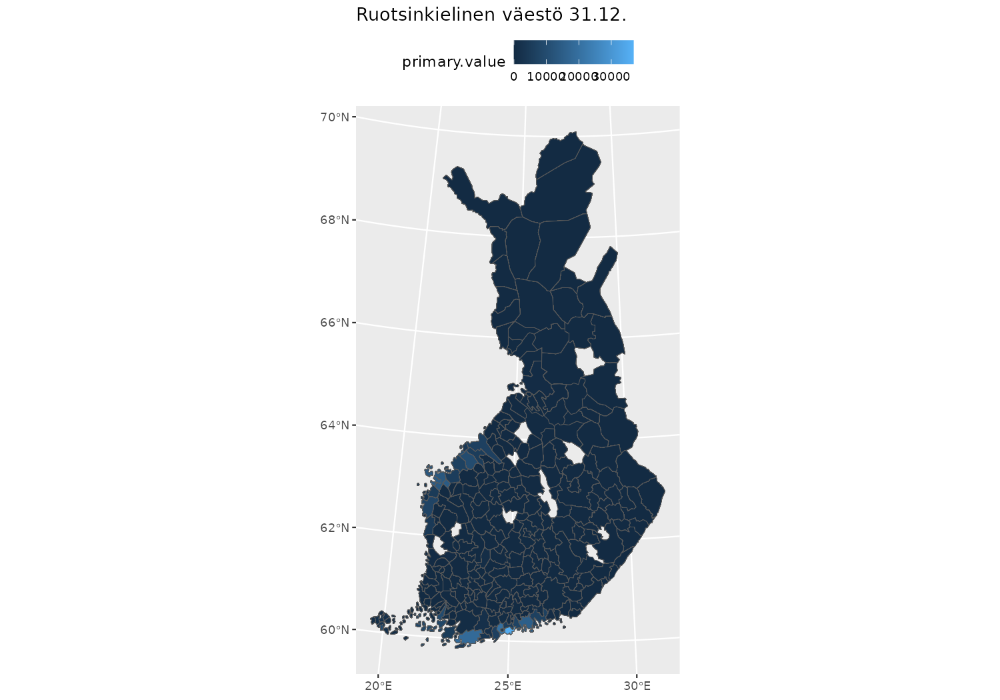
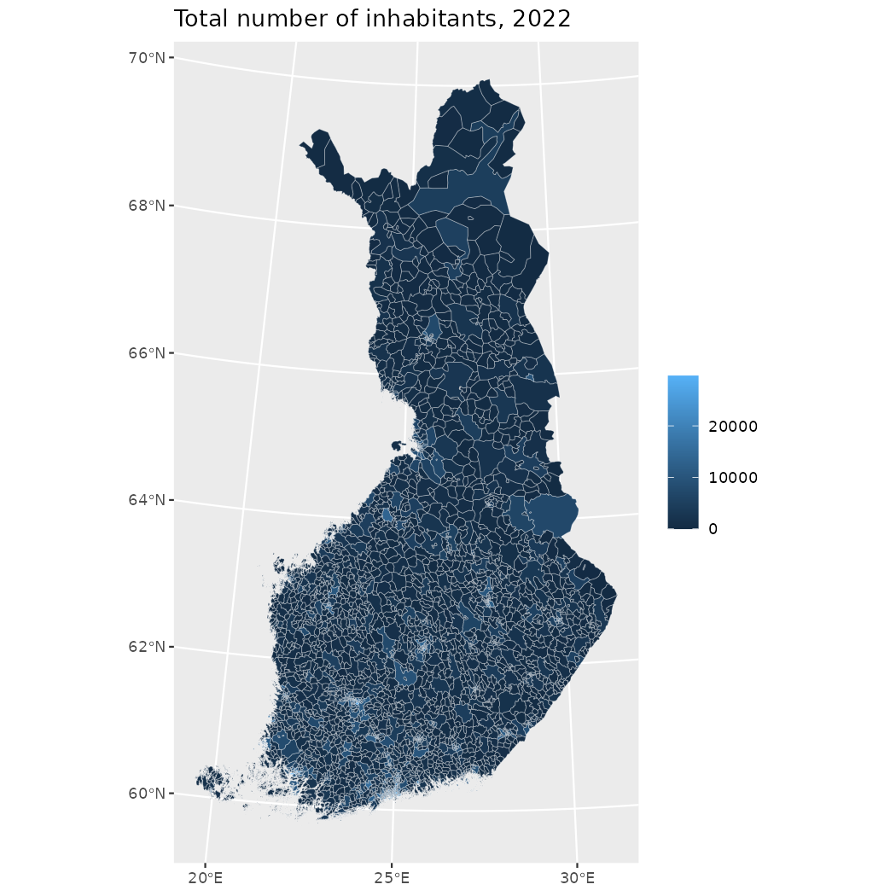

# Joining attribute data with geofi data

This vignettes provides few examples on how to join attribute data from
common sources of attribute data. Here we are using data from [THL
Sotkanet](https://sotkanet.fi/sotkanet/en/index) and [Paavo (Open data
by postal code
area)](https://pxdata.stat.fi/PXWeb/pxweb/en/Postinumeroalueittainen_avoin_tieto/).

**Installation**

`geofi` can be installed from CRAN using

``` r
# install from CRAN
install.packages("geofi")

# Install development version from GitHub
remotes::install_github("ropengov/geofi")
```

## Municipalities

Municipality data provided by
[`get_municipalities()`](https://ropengov.github.io/geofi/reference/get_municipalities.md)-function
contains 77 indicators variables from each of 309 municipalities.
Variables can be used either for aggregating data or as keys for joining
attribute data.

### Population data from Sotkanet

In this first example we join municipality level indicators of
*Swedish-speaking population at year end* from Sotkanet [population
data](https://sotkanet.fi/sotkanet/en/haku?g=219), Dataset is provided
as part of geofi package as
[`geofi::sotkadata_swedish_speaking_pop`](https://ropengov.github.io/geofi/reference/sotkadata_swedish_speaking_pop.md).

``` r
library(geofi)
muni <- get_municipalities(year = 2023)

library(dplyr)
sotkadata_swedish_speaking_pop <- geofi::sotkadata_swedish_speaking_pop
```

This is not obvious to all, but have the municipality names in Finnish
among other regional breakdowns which allows us to combine the data with
spatial data using `municipality_name_fi`-variable.

``` r
map_data <- right_join(muni, 
                       sotkadata_swedish_speaking_pop, 
                       by = c("municipality_code" = "municipality_code"))
```

Now we can plot a map showing
`Share of Swedish-speakers of the population, %` and
`Share of foreign citizens of the population, %` on two panels sharing a
scale.

``` r

library(ggplot2)
map_data |> 
  ggplot(aes(fill = primary.value)) + 
  geom_sf() + 
  labs(title = unique(sotkadata_swedish_speaking_pop$indicator.title.fi)) +
  theme(legend.position = "top")
```



## Zipcode level

You can download data from [Paavo (Open data by postal code
area)](https://pxdata.stat.fi/PXWeb/pxweb/en/Postinumeroalueittainen_avoin_tieto/)
using [`pxweb`](https://ropengov.github.io/pxweb/)-package. In this
example we use dataset that can be downloaded preformatted in `csv`
format directly from Statistics Finland. Population data is provided as
part of geofi package as
[`geofi::statfi_zipcode_population`](https://ropengov.github.io/geofi/reference/statfi_zipcode_population.md).

``` r
statfi_zipcode_population <- geofi::statfi_zipcode_population
```

Before we can join the data, we must extract the numerical postal code
from `postal_code_area`-variable.

``` r
# Lets join with spatial data and plot the area of each zipcode
zipcodes19 <- get_zipcodes(year = 2019) 
zipcodes_map <- left_join(zipcodes19, 
                          statfi_zipcode_population)
ggplot(zipcodes_map) + 
  geom_sf(aes(fill = X2022), 
          color  = alpha("white", 1/3)) +
  labs(title = "Total number of inhabitants, 2022", 
       fill = NULL)
```


