# Spatial data manipulation and analysis using R and geofi-package

**Installation**

`geofi` can be installed from CRAN using

``` r
# install from CRAN
install.packages("geofi")

# Install development version from GitHub
remotes::install_github("ropengov/geofi")
```

Manuel Gimonds [Intro to GIS and Spatial
Analysis](https://mgimond.github.io/Spatial/index.html) and especially
it’s appendixes provide a good introduction to working with spatial data
in R.

## Coordinate reference systems

From the book above, have a look at chapter [Coordinate Systems in
R](https://mgimond.github.io/Spatial/coordinate-systems-in-r.html)
first.

When using spatial data in R it necessary to have all data in same
coordinate reference system (CRS). You can check the CRS of you
`sf`-object with
[`sf::st_crs()`](https://r-spatial.github.io/sf/reference/st_crs.html)-function.
All the data you can obtain using `geofi` is transformed automatically
into `EPSG:3067`. Most of spatial data providers in Finland provide
their data in the same CRS.

``` r
library(geofi)
library(sf)
library(dplyr)
muni <- get_municipalities()
point <- municipality_central_localities()
crs <- st_crs(muni)
crs$input
#> [1] "EPSG:3067"
```

However, sometimes data is not correctly projected and you have to
reproject it using `st_transform`. Web maps like Google maps or Leaflet
use *WGS 1984 geographic (long/lat) coordinate system* which is fine
with added interactive feature, but should be avoided when plotting data
on maps elsewhere. This is especially the case with large northern
countries like Finland. To demonstrate the effect lets reproject the
municipality data to WGS 1984 (using EPSG code equivalent `4326`) and
plot it side to side with `EPSG:3067`

``` r
muni_4326 <- st_transform(muni, "EPSG:4326")
crs <- st_crs(muni_4326)
crs$input
#> [1] "EPSG:4326"

library(ggplot2)
  
p1 <- ggplot(muni |> st_union()) + 
  geom_sf() + 
  labs(subtitle = "EPSG:3067")
p2 <- ggplot(muni_4326 |> st_union()) + 
  geom_sf() +
  labs(subtitle = "EPSG:4326")
library(patchwork)
wrap_plots(list(p1,p2), nrow = 1) +
  plot_annotation(title = "Map of Finland in two different CRS")
```

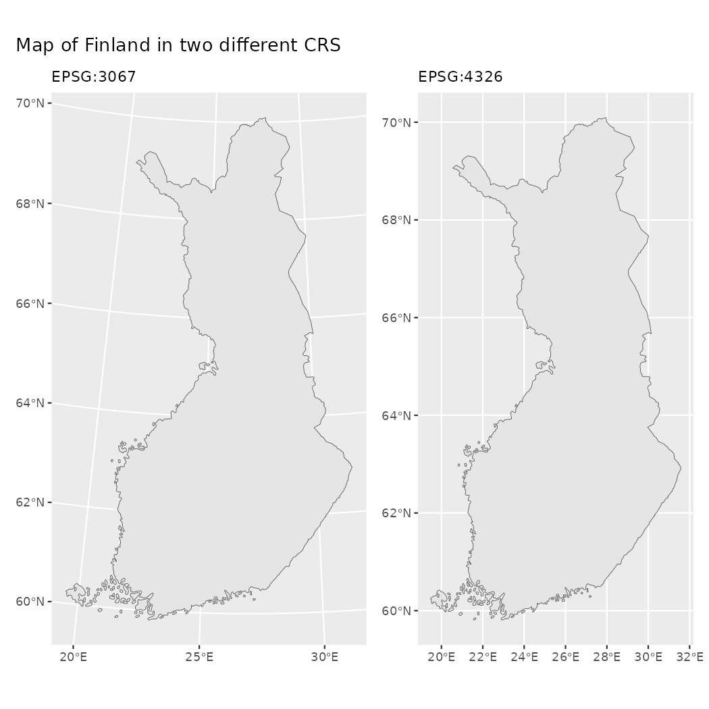

You can see the that northern Finland is larger on the right and the
grid below is different.

## Area

To compute the area of polygons (municipality in this case), ordering
them by size and plotting largest/smalles 10 can be as this.

``` r
# compute area
muni$area <- sf::st_area(muni)
# largest
muni |> 
  arrange(desc(area)) |> 
  slice(1:10) |> 
  ggplot() + 
  geom_sf() + 
  geom_sf_label(aes(label = name_fi)) +
  labs(title = "largest 10")
```

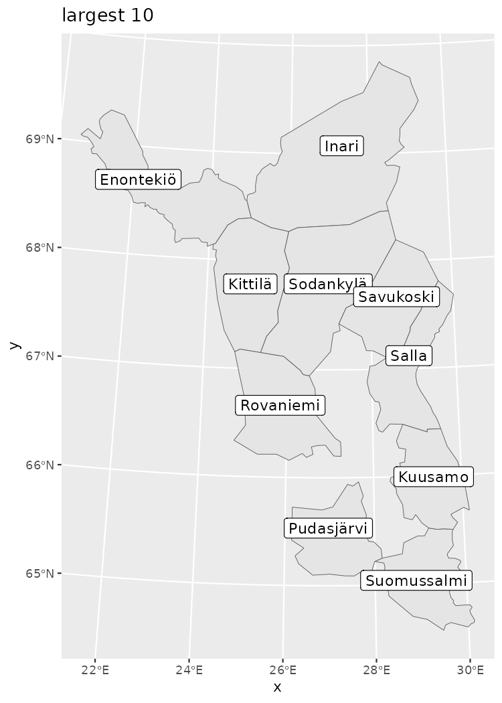

``` r
  # smallest
muni |> 
  arrange(area) |> 
  slice(1:10) |> 
  ggplot() + 
  geom_sf() + 
  geom_sf_label(aes(label = name_fi)) +
  labs(title = "smallest 10")
```

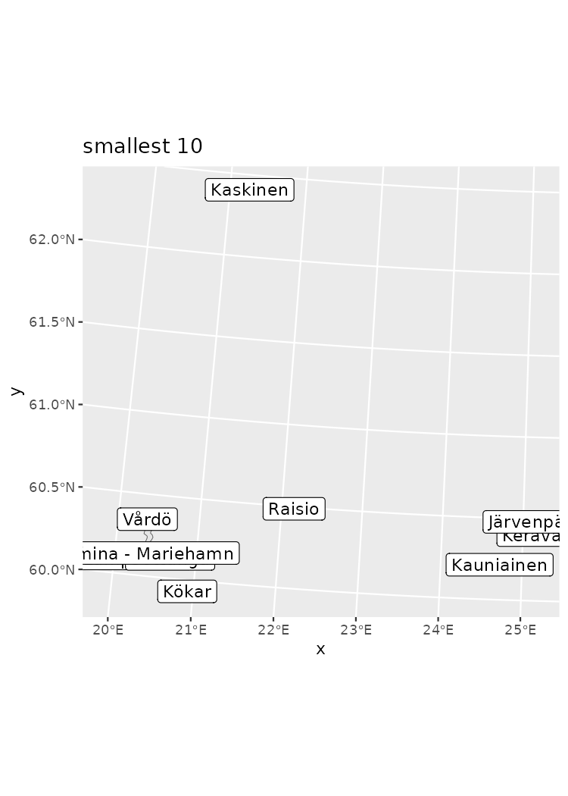

## Subsetting

You can subset data your plotting by subsetting your data in
conventional filtering codes/names, or you can use geometric operations
such as bounding box or intersection.

Lets imagine that we need a more detailed view of the metropolitan area
of the Greater Helsinki that consist of the following municipalities:
Espoo, Helsinki, Vantaa, Hyvinkää, Järvenpää, Kauniainen, Kerava,
Kirkkonummi, Mäntsälä, Nurmijärvi, Pornainen, Sipoo, Tuusula and Vihti.
You can subset the data just using the names of municipalities.

``` r
greater_helsinki <- c('Espoo','Helsinki','Vantaa','Hyvinkää',
                      'Järvenpää','Kauniainen','Kerava','Kirkkonummi',
                      'Mäntsälä','Nurmijärvi','Pornainen','Sipoo','Tuusula','Vihti')
greater_helsinki_polygon <- muni |> filter(municipality_name_fi %in% greater_helsinki)

ggplot(greater_helsinki_polygon) + 
  geom_sf() +
  geom_sf(data = point |> 
            filter(teksti %in% toupper(greater_helsinki)))
```

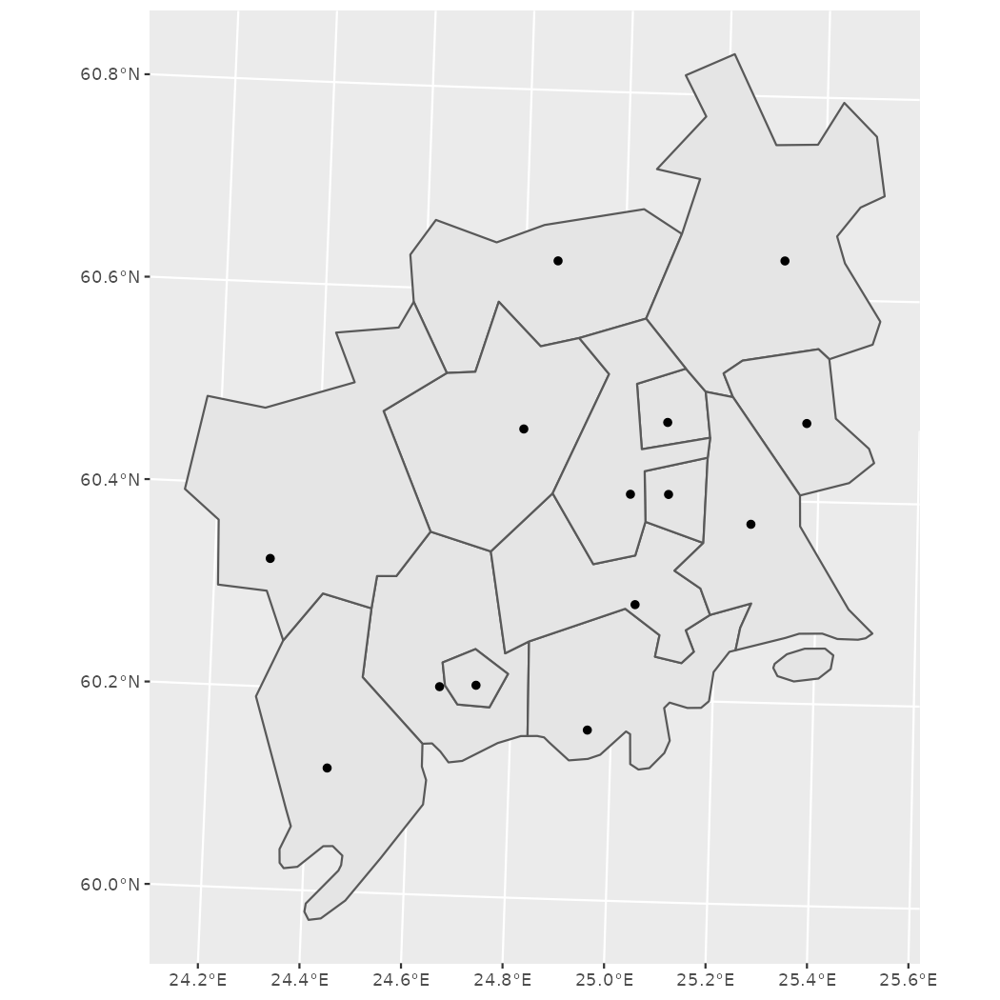

### Subsetting using bounding boxes

First, let’s create [bounding
box](https://en.wikipedia.org/wiki/Minimum_bounding_rectangle) from
greater Helsinki polygons.

``` r
bounding_box_polygon <- st_as_sfc(st_bbox(muni |> filter(municipality_name_fi %in% greater_helsinki)))

ggplot(st_intersection(bounding_box_polygon, muni)) + 
  geom_sf() +
  geom_sf(data = point |> filter(teksti %in% toupper(greater_helsinki)))
```

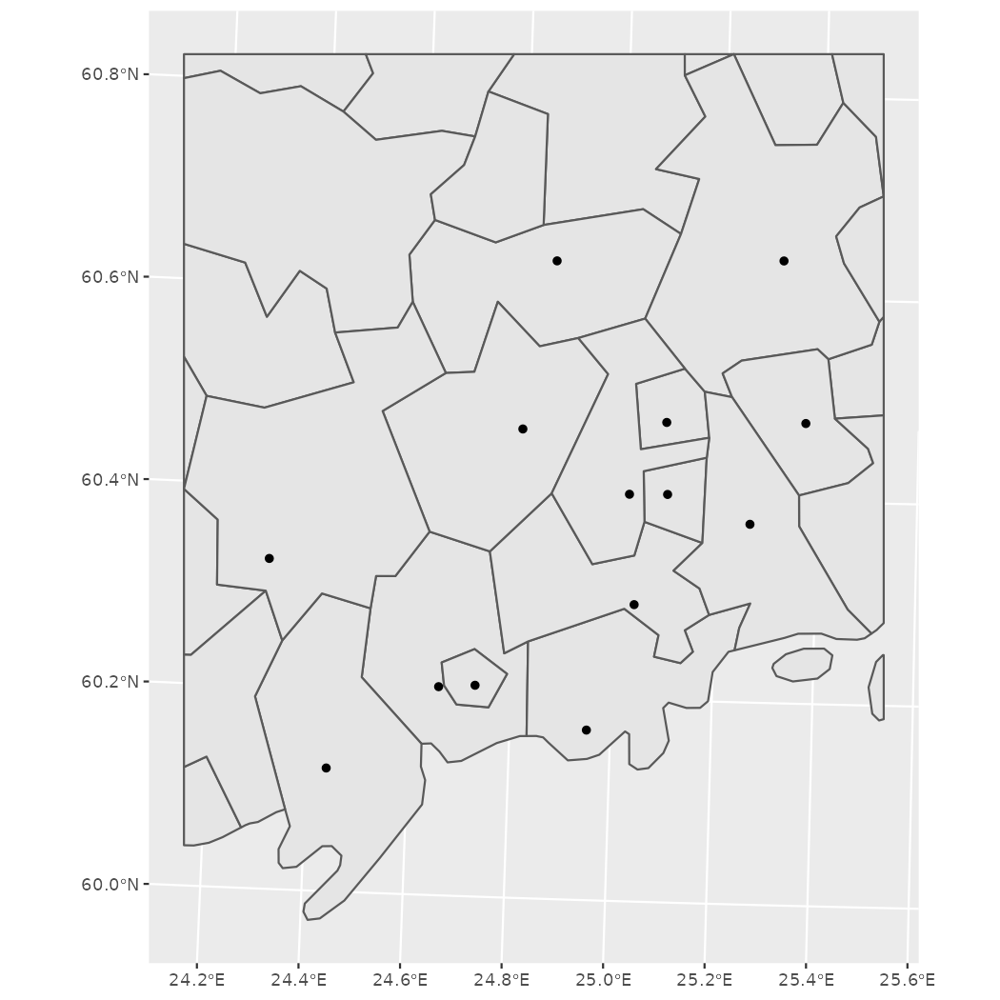

Then, let’s use the point data (municipality central localities) to
create the bounding box

``` r
bounding_box_point <- st_as_sfc(st_bbox(point |> filter(teksti %in% toupper(greater_helsinki))))

ggplot(st_intersection(bounding_box_point, muni)) + 
  geom_sf() +
  geom_sf(data = point |> filter(teksti %in% toupper(greater_helsinki)))
```

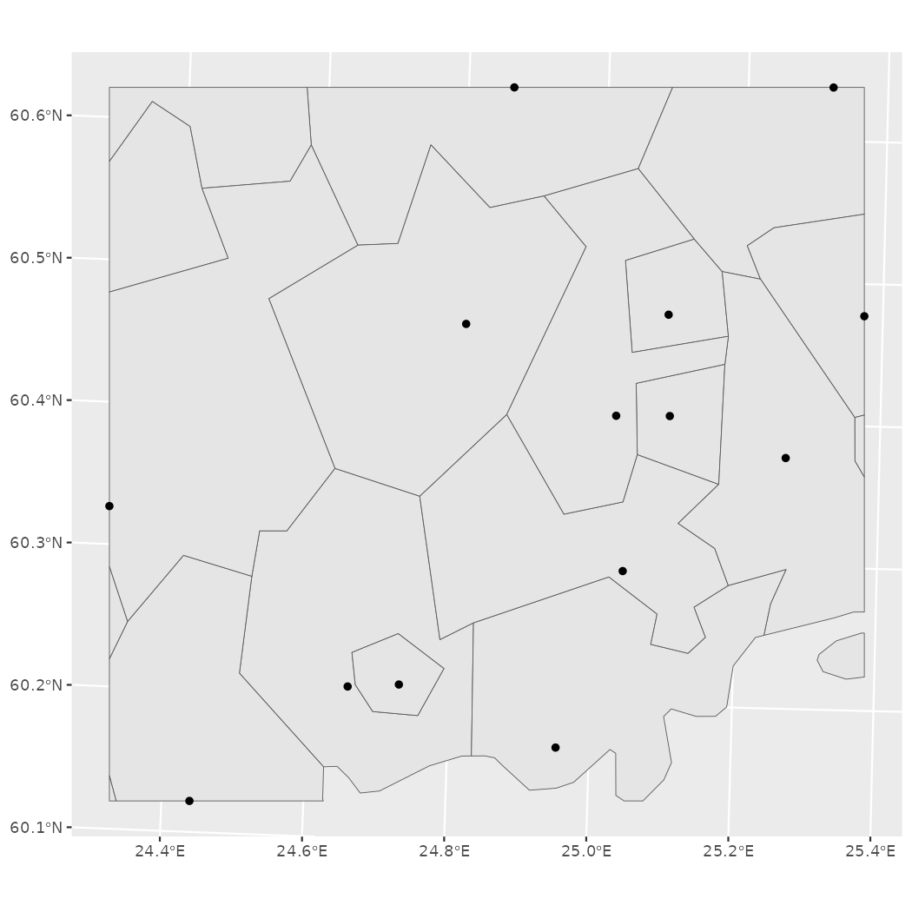

### Subsetting neigbours

Neighboring or intersecting objects can be found using
[`st_intersection()`](https://r-spatial.github.io/sf/reference/geos_binary_ops.html)
in following manner where we plot Helsinki and it’s neighbors.

``` r
helsinki <- muni |>  filter(municipality_name_fi == "Helsinki")
neigbour_codes <- st_intersection(muni,helsinki) |> 
  pull(municipality_code)

ggplot(muni |> filter(municipality_code %in% neigbour_codes)) +
  geom_sf() +
  geom_sf_label(aes(label = municipality_name_fi))
```

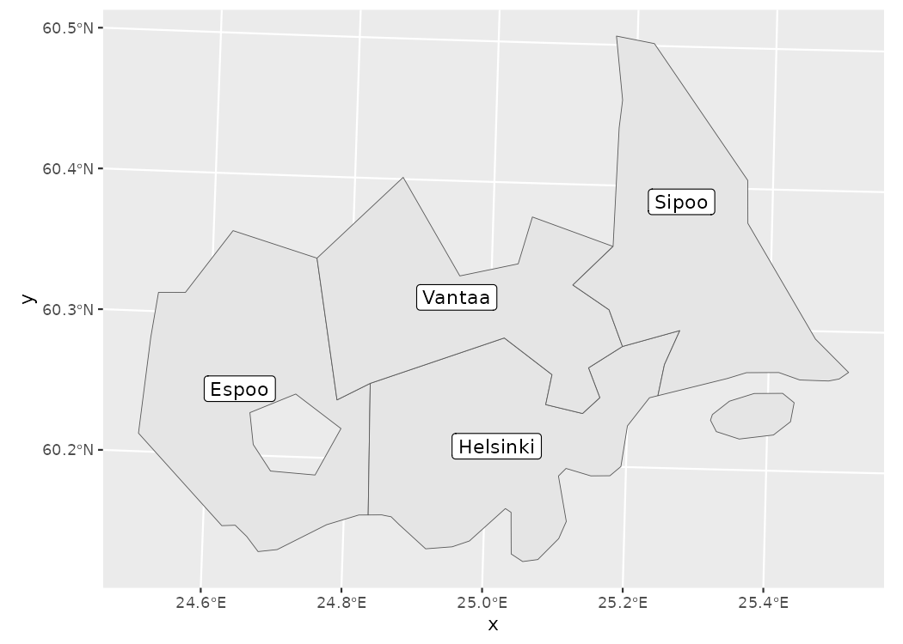

## Dissolving polygons (Union)

Often there is need to create alternative regional breakdown to existing
ones and aggregating data accordingly. First we need to subset the
required members and then dissolve them using
[`st_union()`](https://r-spatial.github.io/sf/reference/geos_combine.html).
Below we classify municipalities in three equal size categories based on
area, dissolve them and plot.

Lets first plot the smallest category as a single multipolygon.

``` r
muni$area_class <- cut_number(x = as.numeric(muni$area), n = 3)

muni |> 
  filter(area_class == levels(muni$area_class)[1]) |> 
  st_union() |> 
  ggplot() +
  geom_sf()
```

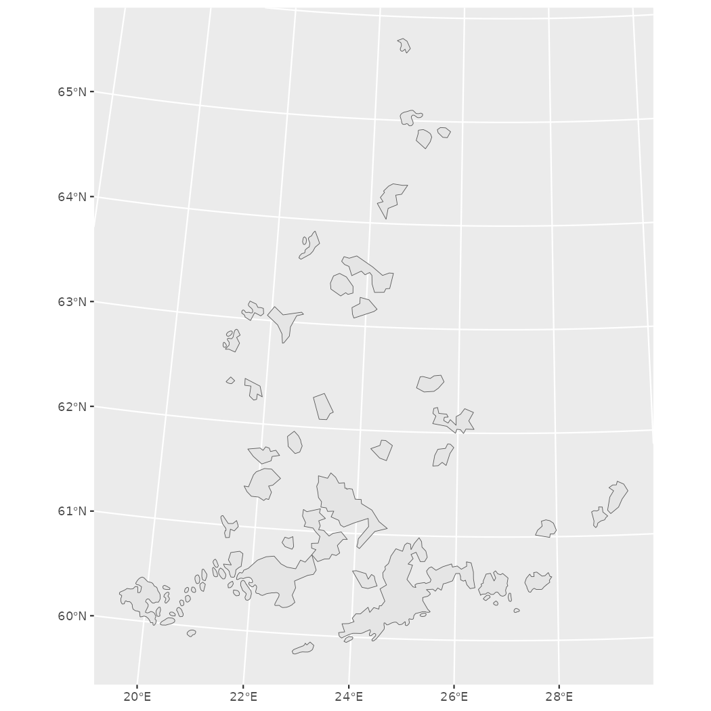

To union all three into same data you can use `group_by` and `summarise`

``` r
muni |> 
  group_by(area_class) |>
  summarise() |> 
  ggplot() +
  geom_sf(aes(fill = area_class))
```

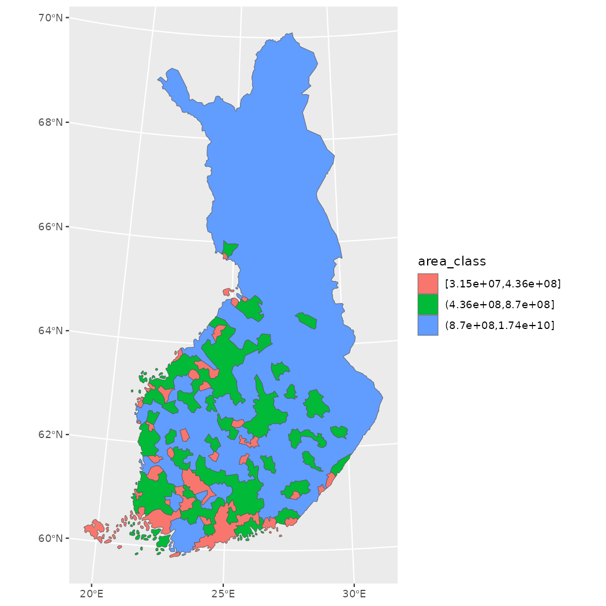

## Centroids, buffers, grids and voronois

The following operations derive from [Marko
Kallio’s](http://markokallio.fi/) course at [CSC](https://csc.fi/en/) in
February 2020 [Spatial data analysis with
R](https://github.com/csc-training/r-spatial-course).

### Polygon centroids

`geofi` contains a function for retrieving municipality central
locations
([`geofi::municipality_central_localities()`](https://ropengov.github.io/geofi/reference/municipality_central_localities.md)).
Instead of those you may need the actual geographical centers ie.
centroids of a polygon that can be computed using `st_centroid` and
plotted with ggplot.

``` r
muni_centroids <- st_centroid(muni)

ggplot() +
  geom_sf(data = muni) +
  geom_sf(data = muni_centroids, color = "blue") +
  # plot also the municipality_central_localities
  geom_sf(data = municipality_central_localities(), color = "red")
```

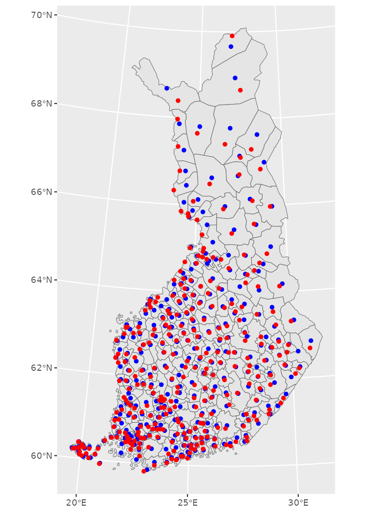

### Buffers

Buffers can be useful, for instance, calculating the share of buildings
that are within certain radius from central localities. That example is
not explained here, but we only show how to create 15km radius around
polygon centroids.

``` r
muni_centroids_buffer <- muni_centroids |>
    st_buffer(dist = 15000)

ggplot() +
  geom_sf(data = muni) +
  geom_sf(data = muni_centroids_buffer) +
  geom_sf(data = muni_centroids, shape = 3)
```

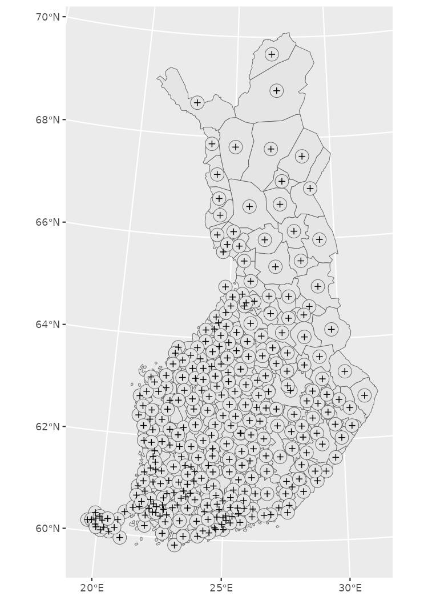

### Creating regular grids

You can download predefined grids from Statistics Finland using
`get_statistical_grid` and
[`get_population_grid()`](https://ropengov.github.io/geofi/reference/get_population_grid.md)
-functions in `geofi`-package. These data contains not just the
geographical shape, but also attribute data on population etc. within
the grid cells.

However, you may need to create your own custom grid, for instance to
aggregate your own point data, which can be created with
[`st_make_grid()`](https://r-spatial.github.io/sf/reference/st_make_grid.html)
function.

As describes by Marko Kallio in [Spatial data analysis with
R](https://github.com/csc-training/r-spatial-course).

> It creates a regular grid over bounding box of an ‘sf’ object. Can be
> given a certain cell size, or number of cells in x and y directions.
> ‘what’ tells the function what kind of regular grid is wanted
> (polygons, corners, centers). Fishnets of lines rather than polygons
> can be created simply by casting the polygons as “LINESTRING”s. The
> resulting polygon grid is an ‘sfc’ object, so it needs to be made ‘sf’
> in order for us to add the ID-attribute.

For this example we pick northern Muonio municipality and create a
custom 2km\*4km grid on top of it. Afterward we could aggregate the
number of reindeer for each grid cell if we would have the data.

``` r
muonio <- muni |> filter(municipality_name_fi == "Muonio")

grid_sf <- st_make_grid(muonio, cellsize = c(2000,4000), what="polygons") |>
    st_sf()

grid_clip <- st_intersection(grid_sf, muonio)
grid_clip$rank <- 1:nrow(grid_clip)

ggplot(grid_clip) +
  geom_sf(aes(fill = rank), color = alpha("white", 1/3), size = 3) +
  scale_fill_viridis_c() +
  theme_minimal()
```

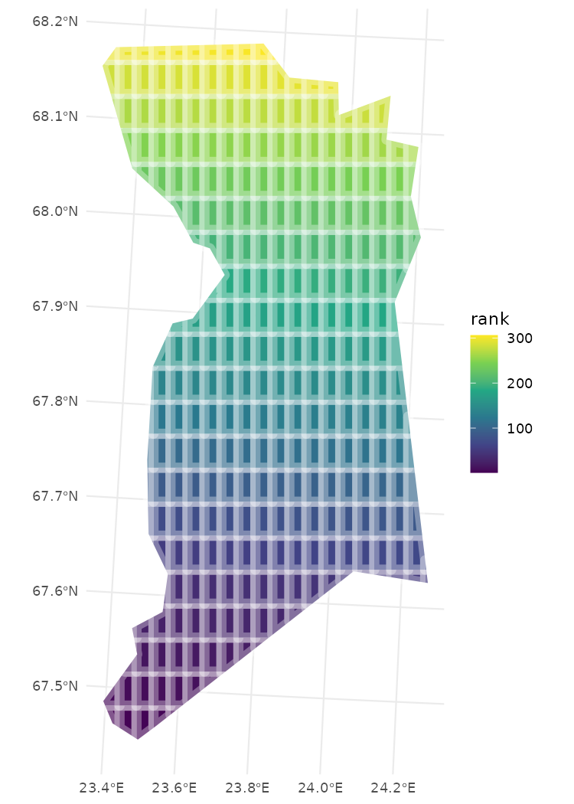

### Voronoi polygons

> In mathematics, a Voronoi diagram is a partition of a plane into
> regions close to each of a given set of objects. Source: [Wikipedia:
> Voronoi diagram](https://en.wikipedia.org/wiki/Voronoi_diagram)

Perhaps not the most useful operation, but worth taking a look as
readily available in `sf` as function `st_voronoi`. In this case, it
creates a layer of polygons that are closest to each municipality
central locality.

``` r
library(geofi)
library(sf)

muni_voronoi <- municipality_central_localities() |> 
  st_union() |>
  st_voronoi() |> 
  st_cast() |> 
  st_sf() |> 
  st_intersection(st_union(muni)) |> 
  mutate(rnk = 1:n())

ggplot(muni_voronoi) + 
  geom_sf(aes(fill = rnk)) +
  geom_sf(data = municipality_central_localities(), shape = 4) +
  scale_fill_fermenter(palette = "YlGnBu") +
  theme_minimal() +
  theme(axis.text = element_blank(),
        axis.title = element_blank(),
        panel.grid = element_blank(),
        legend.position = "none")
```

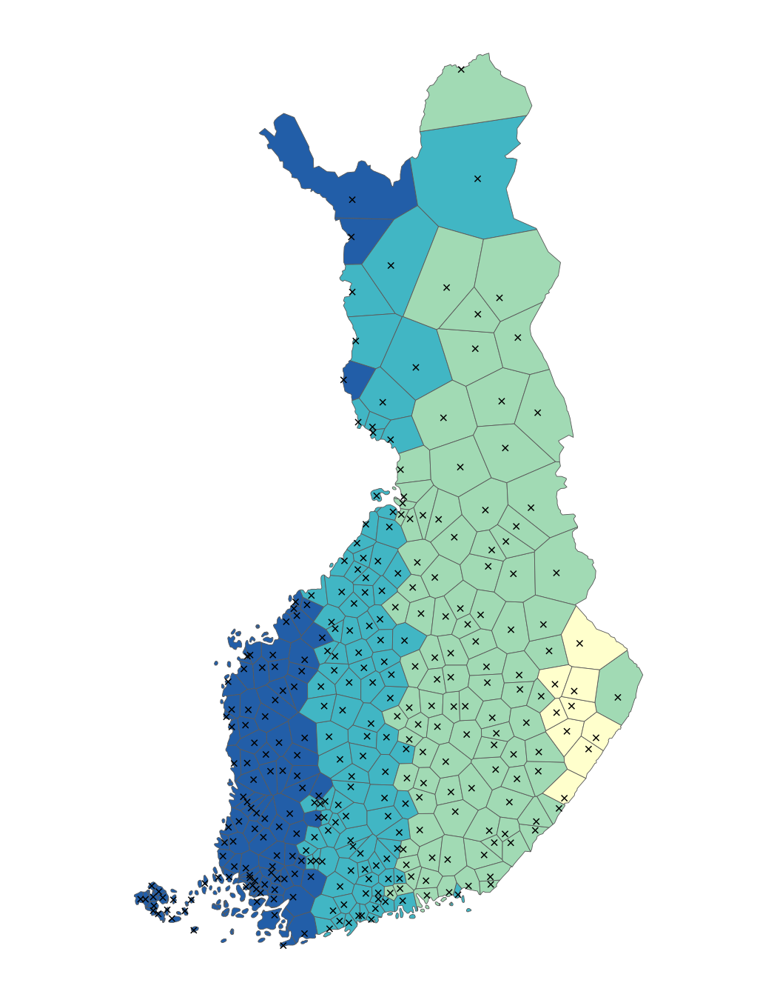

## Calculating distances

Calculating distances is certainly at the core of geospatial analysis.
In this exercise we are interested on calculating distances between
municipality central localities in Finland. As expected, we are talking
great circle distances here, ie. *as the crow flies* type of distances.

You can calculate distance matrices using
[`st_distance()`](https://r-spatial.github.io/sf/reference/geos_measures.html)-function
from [sf](https://r-spatial.github.io/sf/index.html)-package that
computes distances between pairs of geometries. `geofi`-package contains
a function
[`municipality_central_localities()`](https://ropengov.github.io/geofi/articles/geofi_datasets.html#central-localities-of-municipalities)
that we use to calculate distances between points.

First we need to subset the data and replace original municipality name
column (`teksti`) with *better* from latest municipality key.

``` r
kunta <- geofi::municipality_central_localities() |>  
  select(teksti,kuntatunnus) |>
  mutate(kuntatunnus = as.integer(kuntatunnus)) |>
  select(-teksti) |>
  left_join(geofi::municipality_key_2025 |> select(municipality_code, municipality_name_fi),
            by = c("kuntatunnus" = "municipality_code")) |>
  rename(teksti = municipality_name_fi)
kunta
#> Simple feature collection with 309 features and 2 fields
#> Geometry type: POINT
#> Dimension:     XY
#> Bounding box:  xmin: 91954.76 ymin: 6638646 xmax: 701036.8 ymax: 7755601
#> Projected CRS: ETRS89 / TM35FIN(E,N)
#> First 10 features:
#>    kuntatunnus    teksti                 geometry
#> 1          890   Utsjoki POINT (501086.5 7755601)
#> 2          148     Inari POINT (522136.3 7616266)
#> 3           47 Enontekiö POINT (362091.4 7589569)
#> 4          273    Kolari POINT (362088.2 7471921)
#> 5          976 Ylitornio POINT (350962.8 7359884)
#> 6          732     Salla POINT (573395.9 7413832)
#> 7          854     Pello POINT (366564.7 7409490)
#> 8          578   Paltamo POINT (540087.8 7142933)
#> 9          205   Kajaani   POINT (535577 7122153)
#> 10         630   Pyhäntä POINT (467440.4 7107996)
```

Let’s aim at a data structure as below with both municipality name and
code both from origin and destination.

| origin_name | origin_code | destination_name | destination_code | dist_m |
|-------------|-------------|------------------|------------------|--------|
| Helsinki    | 91          | Espoo            | 92               | 15000  |
| Vantaa      | 93          | Espoo            | 92               | 18000  |
| Espoo       | 92          | Espoo            | 92               | 0      |

To get there lets create a for loop that calculates distance matrices
from each municipality to all municipalities, assign each data to a list
and finally bind the data frames into a single data.

``` r
d_list <- list()
kuntadatan_teksti_ja_kuntatunnus <- sf::st_drop_geometry(kunta) |>
  select(teksti,kuntatunnus)
for (i in 1:nrow(kunta)){
  dist_tmp <- sf::st_distance(x = kunta[i,], y =  kunta)
  tibble(origin_name = kunta[i,]$teksti,
         origin_code = kunta[i,]$kuntatunnus) |>
    bind_cols(kuntadatan_teksti_ja_kuntatunnus |> rename(destination_name = teksti,
                                                          destination_code = kuntatunnus)) |>
    mutate(dist = dist_tmp[1,]) -> d_list[[i]]
}
kunta_dist <- do.call("bind_rows", d_list) |>
  mutate(dist = as.numeric(dist))
head(kunta_dist)
#> # A tibble: 6 × 5
#>   origin_name origin_code destination_name destination_code    dist
#>   <chr>             <int> <chr>                       <int>   <dbl>
#> 1 Utsjoki             890 Utsjoki                       890      0 
#> 2 Utsjoki             890 Inari                         148 140915.
#> 3 Utsjoki             890 Enontekiö                      47 216532.
#> 4 Utsjoki             890 Kolari                        273 315903.
#> 5 Utsjoki             890 Ylitornio                     976 423236.
#> 6 Utsjoki             890 Salla                         732 349334.
```

Finally we can draw two plots to verify our results. First let’s draw a
bar plot of 20 municipality central localities nearest to Helsinki

``` r
ggplot(kunta_dist |>
         filter(origin_name == "Helsinki") |>
         arrange(dist) |> slice(1:20),
       aes(x = dist, y = reorder(destination_name, dist), label = round(dist))) +
         geom_col() + geom_text(aes(x = 1000), color = "white", hjust = 0) +
  labs(title = "Nearest 20 municipality localities to Helsinki", x = "distance in meters")
```

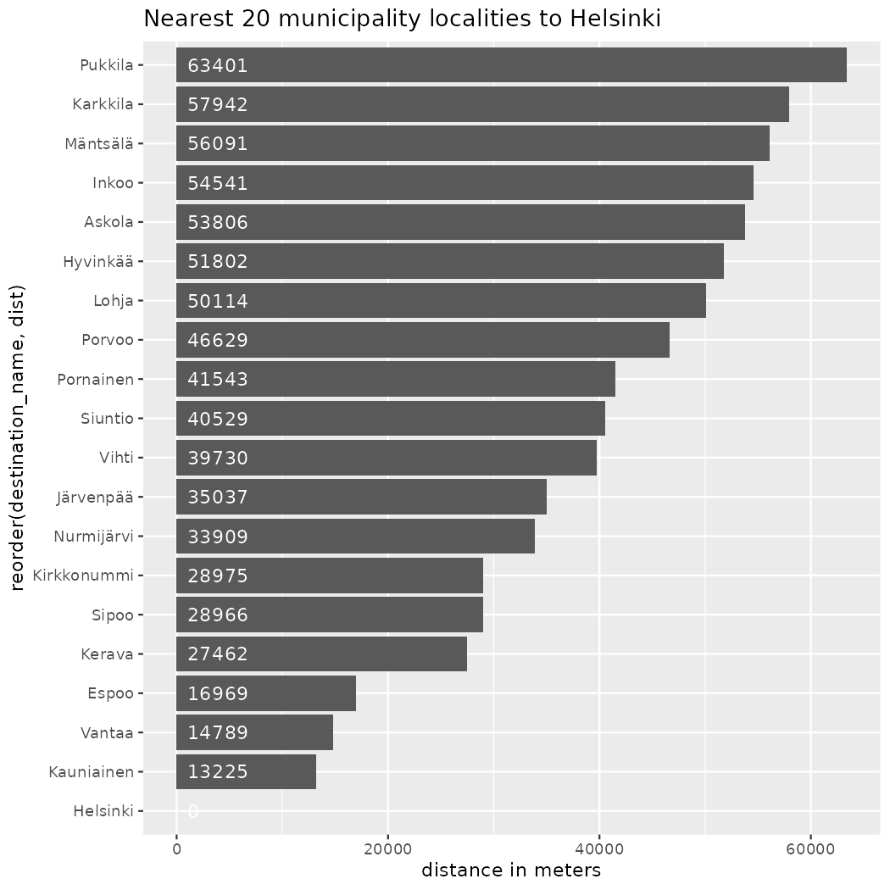

Then, lets find the municipality central locality that is nearest to the
center of Finland.

``` r
# We firt need the country map as a single polygon
geofi::get_municipalities() |> 
  sf::st_union() |> 
  # then we need to compute the centroid of that polygon
  sf::st_centroid() -> fin_centroid

# The let's find the nearest neighbour with
distance <- st_distance(x = fin_centroid, y = kunta)
kuntadatan_teksti_ja_kuntatunnus |> 
  mutate(dist = as.numeric(distance)) |> 
  arrange(dist) -> closest_to_center
head(closest_to_center)
#>       teksti kuntatunnus     dist
#> 1 Siikalatva         791 13582.66
#> 2    Pyhäntä         630 17512.41
#> 3  Kärsämäki         317 33270.89
#> 4  Haapavesi          71 38730.91
#> 5      Vaala         785 50150.05
#> 6   Utajärvi         889 61041.41
```

And finally lets draw a bar plot of 20 furthest localities

``` r
furthest20 <- kunta_dist |>
         filter(origin_name == closest_to_center[1,]$teksti) |>
         arrange(desc(dist)) |> slice(1:20)
ggplot(furthest20,
       aes(x = dist, y = reorder(destination_name, dist), label = round(dist))) +
  geom_col() + geom_text(aes(x = 10000), color = "white", hjust = 0) +
  labs(title = paste("Furthest 20 municipality localities \nfrom the most central locality of ", closest_to_center[1,]$teksti), x = "distance in meters")
```

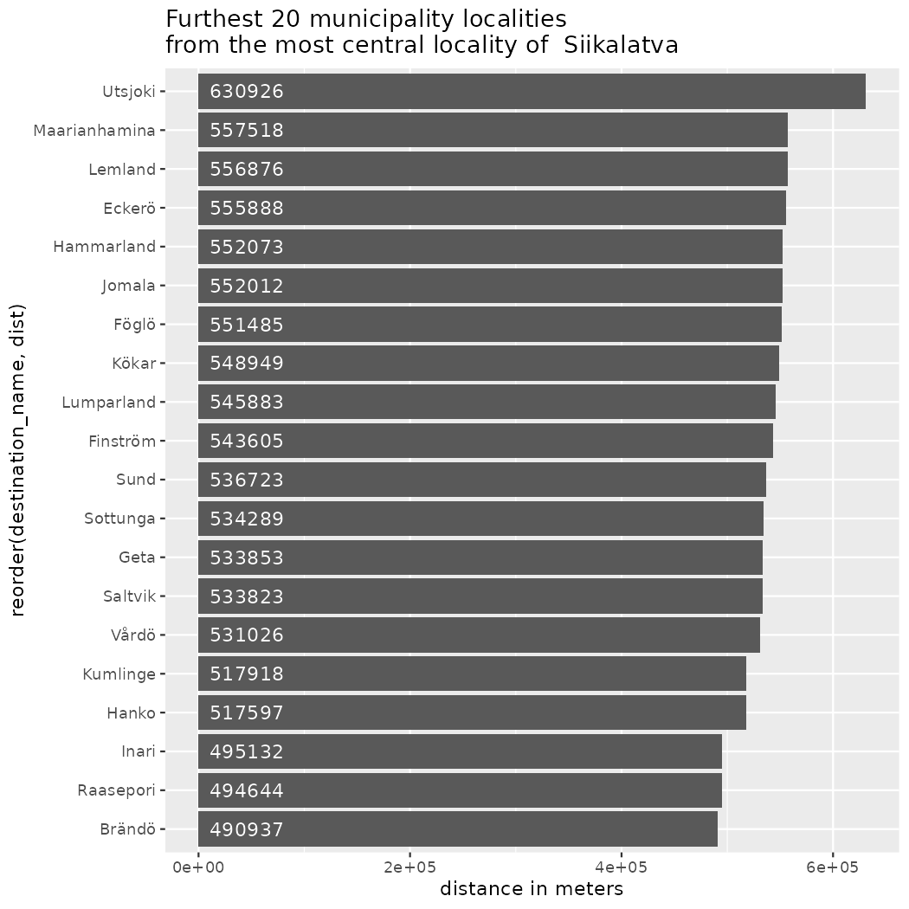

And at very last, we need to show those distances also on a map.

``` r
sf_lahto <- kunta |> 
  filter(teksti %in% closest_to_center[1,]$teksti) |>
  select(teksti)
sf_paate <- kunta |> 
  filter(teksti %in% furthest20$destination_name) |> 
  select(teksti)

triplst <- list()
for (i in 1:nrow(sf_paate)){
triplst[[i]] <- rbind(
  sf_lahto,
  sf_paate[i,]
) |> 
  summarize(m = mean(row_number()),do_union=FALSE) |> 
  st_cast("LINESTRING")
}
trips <- do.call("rbind", triplst)

ggplot() +
  geom_sf(data = muni |> st_union(), alpha = .3) +
  geom_sf(data = trips, color = "dim grey") +
  geom_sf_label(data = sf_lahto, aes(label = teksti)) +
  geom_sf_text(data = sf_paate, aes(label = teksti))
```

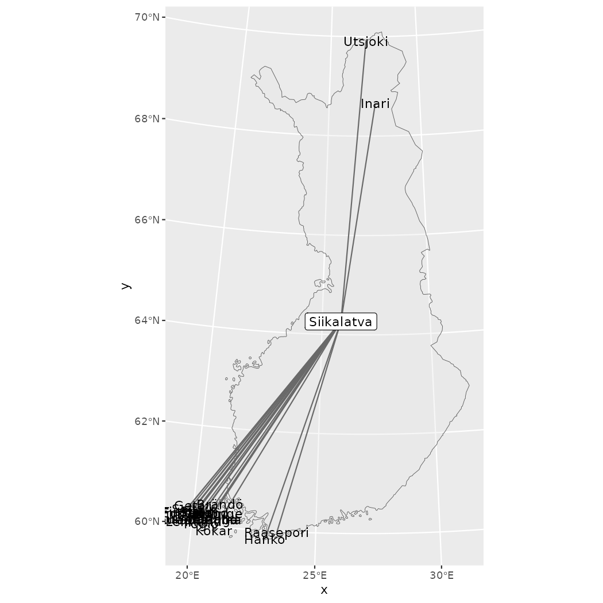
