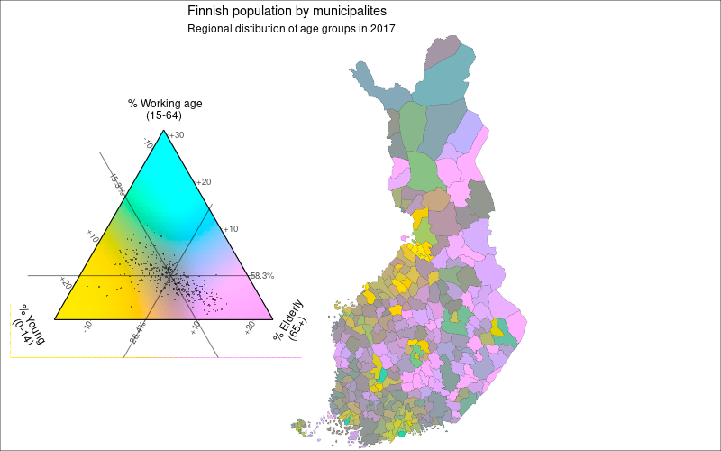

```{r setup, include = FALSE}
knitr::opts_chunk$set(
  collapse = TRUE,
  comment = "#>",
  fig.height = 7, 
  fig.width = 7,
  dpi = 75
)
```


## Preparation

For this example geodata is joined with municipality level data from Statistics Finland. Load packages which are needed for data wrangling and plotting. For ternary color coded maps we are using `tricolore` packgage. Check more information of tricolore package in github <https://github.com/jschoeley/tricolore>.

```{r load_packages, eval = TRUE}
library(geofi)
library(dplyr)
library(tidyr)
library(ggplot2)
library(tricolore)
```


## Download and prepare datasets

```{r municipalities_with_data, eval = TRUE}
# Download municipalities geodata
municipalities17 <- get_municipalities(year = 2017)
# Pull municipalities and population data from Statistics Finland
library(pxweb)
pxweb_query_list <- list("Alue 2019"=c("020","005","009","010","016","018","019","035","043","046","047","049","050","051","052","060","061","062","065","069","071","072","074","075","076","077","078","079","081","082","086","111","090","091","097","098","099","102","103","105","106","108","109","139","140","142","143","145","146","153","148","149","151","152","165","167","169","170","171","172","176","177","178","179","181","182","186","202","204","205","208","211","213","214","216","217","218","224","226","230","231","232","233","235","236","239","240","320","241","322","244","245","249","250","256","257","260","261","263","265","271","272","273","275","276","280","284","285","286","287","288","290","291","295","297","300","301","304","305","312","316","317","318","398","399","400","407","402","403","405","408","410","416","417","418","420","421","422","423","425","426","444","430","433","434","435","436","438","440","441","475","478","480","481","483","484","489","491","494","495","498","499","500","503","504","505","508","507","529","531","535","536","538","541","543","545","560","561","562","563","564","309","576","577","578","445","580","581","599","583","854","584","588","592","593","595","598","601","604","607","608","609","611","638","614","615","616","619","620","623","624","625","626","630","631","635","636","678","710","680","681","683","684","686","687","689","691","694","697","698","700","702","704","707","729","732","734","736","790","738","739","740","742","743","746","747","748","791","749","751","753","755","758","759","761","762","765","766","768","771","777","778","781","783","831","832","833","834","837","844","845","846","848","849","850","851","853","857","858","859","886","887","889","890","892","893","895","785","905","908","911","092","915","918","921","922","924","925","927","931","934","935","936","941","946","976","977","980","981","989","992"),
       "Tiedot"=c("M411", "M391","M421","M478"),
       "Vuosi"=c("2017"))
px_data <- pxweb_get(url = "https://pxnet2.stat.fi/PXWeb/api/v1/fi/Kuntien_avainluvut/2019/kuntien_avainluvut_2019_aikasarja.px",
                     query = pxweb_query_list)
# Convert to data.frame and wrangle dataset so that every row is municipality
tk_data <- as.data.frame(px_data, 
                         column.name.type = "text", 
                         variable.value.type = "text")
tk_data <- tk_data %>% 
  rename(name = `Alue 2019`) %>%
  mutate(name = as.character(name),
         # Paste Tiedot and Vuosi
         Tiedot = paste(Tiedot, Vuosi)) %>%
  select(-Vuosi) %>%
  spread(Tiedot, `Kuntien avainluvut`) %>%
  as_tibble()
tk_data <- janitor::clean_names(tk_data)
# Rename variables in english
tk_data <- tk_data %>% 
  rename(
    under_15 = alle_15_vuotiaiden_osuus_vaestosta_percent_2017,
    y16_64 = x15_64_vuotiaiden_osuus_vaestosta_percent_2017,
    over64 = yli_64_vuotiaiden_osuus_vaestosta_percent_2017,
    popu2017 = vakiluku_2017
  )
# Join with Statistics Finland attribute data
dat <- left_join(municipalities17, tk_data)
# Join the municipality level data with internal municipality_key_2017-data
finland_popu2017 <- left_join(dat, municipality_key_2017, by = c("name" = "municipality_name_fi"))
```


### Calculating color-code to the dataset

Ternary color codes are calculated by `Tricolore()`-function, which excepts variables which is used for color coding. Save rgb values to population dataset.

```{r add_tricolore, eval = TRUE}
tric_dat <- Tricolore(finland_popu2017,
                      p1 = 'under_15', 
                      p2 = 'y16_64', 
                      p3 = 'over64',
                      center = NA,
                      crop = TRUE
                      )
finland_popu2017$popu_rgb <- tric_dat$rgb
```

Plot map by ggplot and use `scale_fill_identity()` option to make sure that each region is color coded by rgb-code.

```{r plot_simplemap1, fig.width = 5}
plot_pop <- ggplot(finland_popu2017) +
  geom_sf(aes(fill = popu_rgb, geometry = geom), size = .1) +
  scale_fill_identity() 
plot_pop
```

Ternary colors can be adjusted to distinct municipalies differences better.

```{r edit_tricolore}
tric_dat <- Tricolore(finland_popu2017,
                      p1 = 'under_15', 
                      p2 = 'y16_64', 
                      p3 = 'over64',
                      center = NA,
                      crop = TRUE,
                      spread = 3,
                      contrast = .4, 
                      lightness = 1, 
                      chroma = 1, 
                      hue = 2/12
                      )
finland_popu2017$popu_rgb <- tric_dat$rgb
```

```{r plot_simplemap2, fig.width = 5}
plot_pop <- ggplot(finland_popu2017) +
  geom_sf(aes(fill = popu_rgb, geometry = geom), size = .1) +
  scale_fill_identity() 
plot_pop
```


### Building legend for a plot

Legend for tertinary color is added by `ggtern` and `annotation_custom()`. Package `ggtern` is important to load after `ggplot2` package.

```{r plot_finalmap,  fig.height = 10}
library(ggtern)
plot_pop <- ggplot(finland_popu2017) +
  geom_sf(aes(fill = popu_rgb, geometry = geom), size = .1) +
  coord_sf(xlim = c(-2e5,7.5e5), ylim = c(66.3e5, 77.7e5), expand = FALSE, datum = NA) +
  annotation_custom(
    ggplotGrob(tric_dat$key + labs(L = "% Young\n(0-14)", T = " % Working age\n(15-64)", R = "% Elderly\n(65+)")) ,
    xmin = -7e5, xmax = 1.7e5, ymin = 68e5, ymax = 77e5
  ) +
  scale_fill_identity() +
  theme_void() +
  labs(title = "Finnish population by municipalites",
       subtitle = "Regional distibution of age groups in 2017.")
plot_pop
```


## Save plot as png

You can adjust plot to grid and save as png file

```{r}
library(grid)
library(useful)
png("./plot_tricolore.png", width = 800, height = 500, units = "px")
grid.newpage() 
pushViewport(viewport(layout = grid.layout(2, 1)))
grid.rect(gp = gpar(fill = "white"))
print(plot_pop, vp = vplayout(1:2, 1:1))
dev.off()
```




